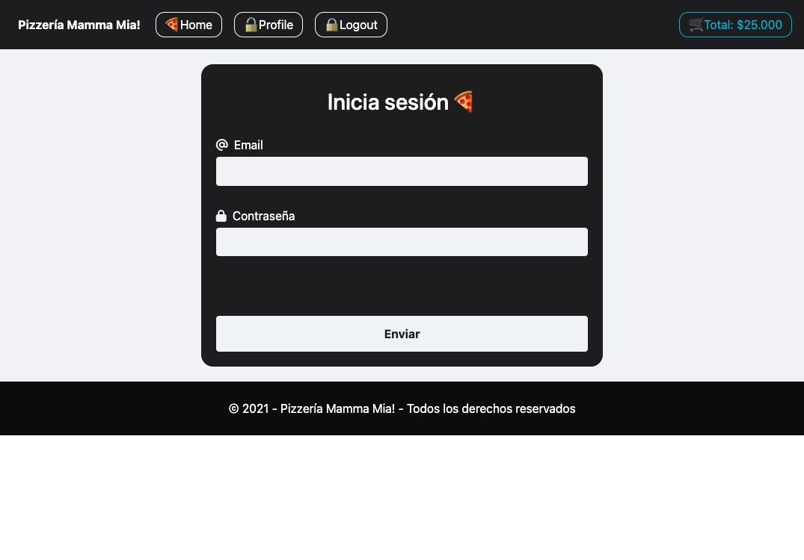
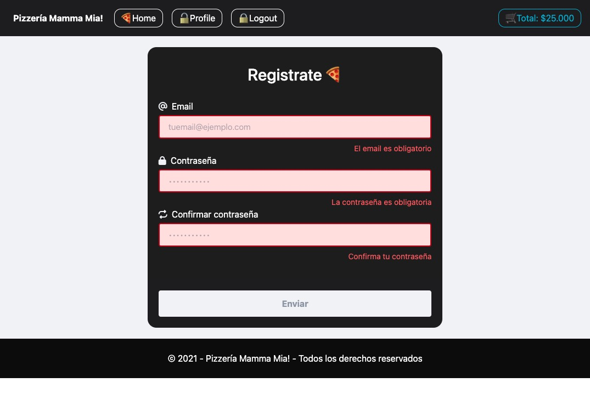

# Pizzería Mamma Mía — Hito 2 🍕

Entrega del Hito 2: Estado de los componentes y eventos.

Se trabajó el manejo de estado con `useState`, validaciones básicas y eventos en formularios y botones.
---

## ✨ Funcionalidades
- **Navbar dinámico:** Renderiza opciones según `token` (mock en `Navbar.jsx`). Muestra el total del carrito formateado con `formatCLP`.
- **Header + Home:** Se incluye un header y 3 tarjetas de pizzas (**CardPizza**) con nombre, ingredientes y precio.
- **CardPizza:** Botones “Ver más” y “Añadir” (UI preparada para siguientes hitos).
- **Formularios controlados:** Pantallas de **Login** y **Register** con `useState`, validación por campo al `onBlur` y validación final al enviar.
- **Validaciones:** Deshabilita el botón Enviar si hay errores. Muestra mensajes de éxito al completar correctamente.

---

## 🚀 Stack Utilizado
- [React](https://reactjs.org/) + [Vite](https://vitejs.dev/)
- [Tailwind CSS](https://tailwindcss.com/)
- JavaScript (ES6+)

---

## 🖼️ Capturas
- **Login:**
  
  

- **Register:**
  
  
